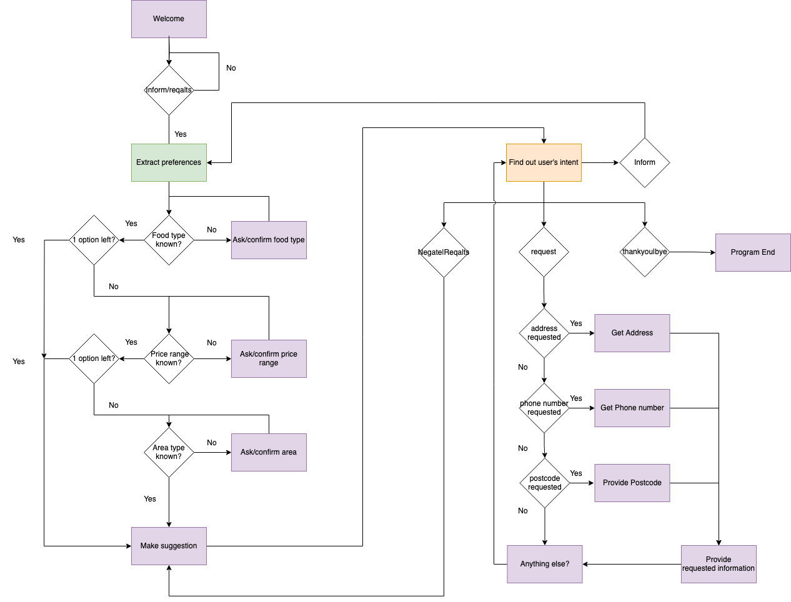

# MAIR-G14

Welcome to the repository for our MAIR project. This project is a chatbot which can help you find a restaurant.

## Functionality

The chatbot can help you find a restaurant based on the following criteria:

- Location
- Cuisine
- Price range

The chatbot will follow the following state-transition diagram to retrieve your preferences and provide you with a restaurant recommendation:

## Installing and running

The following instructions should work on any system running Python version 3.10 and higher.

1. Open the root directory of the project `MAIR-G14`.
2. To install the required packages, run `pip install -r requirements.txt`.
3. Run `python src/main.py` to start a conversation.

If you want to use the speech recognition feature, you need to follow the following additional steps if your OS is listed below:

### Mac

1. `brew install portaudio`
2. `brew install flac`
3. `pip install pyaudio`

## Configuration

The chatbot can be configured by adding arguments to your `python src/main.py` command. The following arguments are available, ordered by relevance:

- `-m` or `--model`: Selects which type of model will be used for intent classification. Available options are: `RF` (uses a Random Forest), `neural` (uses a multilayer perceptron), `keyword` (uses keyword matching), and `majority` (always predicts the majority class). Usage: `-m RF` or `--model RF`.
- `-l` or `--levenshtein`: Allows you to specify the maximum Levenshtein distance between a user input and a keyword for it to be considered a match. Usage: `-l 2` or `--levenshtein 2`.
- `-d` or `--delay`: Allows you to specify the delay between the user's input and the bot's response. Usage: `-d 0.5` or `--delay 0.5`.
- `--typing-speed`: Allows you to speed up or slow down the typing speed of the bot. Larger numbers speed up, smaller numbers slow down. Usage: `--typing-speed 0.5`.
- `--tts`: Enable text-to-speech for bot responses.
- `--speech`: Enable speech recognition for user input.
- `-v` or `--verbose`: Enables verbose logging, this is meant for debugging purposes only.
- `--caps`: All output will be in CAPS-LOCK.

## Linting and formatting

When making changes, please make sure your code is properly linted and formatted.
Please use [Flake8](https://marketplace.visualstudio.com/items?itemName=ms-python.flake8) for linting and Black (`pip install black`)for formatting.
